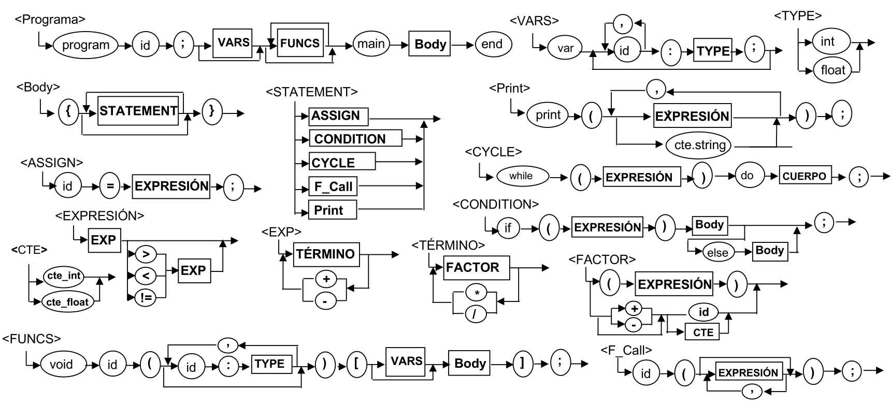

# Módulo 3 - Compiladores

Desarrollo de aplicaciones avanzadas de ciencias computacionales (Gpo 502)

# Entregables
Este repositorio cuenta con todas las tareas del Módulo 3 - Compiladores
* Cada directorio contiene el archivo PDF correspondiente de cada entrega, pero el archivo principal que se extiende en cada entrega es **BabyDuck.docx** y se encuentra en la raíz del repositorio al igual que su PDF correspondiente
* El código fuente se encuentra en **BabyDuck/**

# Proyecto BabyDuck



## Inicializar el proyecto

1. `cd BabyDuck`

2. Crear un ambiente virtual y activarlo
```
python -m venv venv

# ============ Linux/MacOS ============
source venv/bin/activate

# ============== Windows ==============
venv/Scripts/activate
```

3. Instalar las librerías del proyecto
```bash
pip install -r requirements.txt
```

4. **Instalar ANTLR**: no es suficiente con instalar ANTLR como un módulo del proyecto, también se debe instalar como una herramienta del sistema

5. Inicializar el proyecto

## Desarrollo

No es suficiente con escribir la lógica del proyecto, se deben ejecutar ciertos comandos con la herramienta ANTLR
